# 🔀 Mixture of Positional Encodings for Transformers

<div align="center">

**Learning to Select and Combine Positional Encoding Methods for Diverse Tasks**

[](https://www.python.org/downloads/)
[](https://pytorch.org/)
[](LICENSE)
[]()
[]()

*A comprehensive study on positional encoding selection through learned mixture mechanisms*

</div>

---

## 🎯 Research Vision

Transformers use positional encodings (PE) to inject sequence order information—but which PE method should you use? **Binary, Sinusoidal, RoPE, or Learned embeddings?** The answer depends on your task, sequence length, and computational budget.

**Current Problem:** Practitioners must manually select one PE method for their entire application, often through trial-and-error. Different PEs excel at different scenarios, but we're forced to commit to just one.

**Our Solution:** We propose **MoPE (Mixture of Positional Encodings)**, a learned gating mechanism that dynamically selects and combines multiple PE methods based on input characteristics, providing:
- 🎯 **Automatic PE selection** - no more guessing which method to use
- 🔄 **Adaptive combination** - leverage strengths of multiple approaches
- 📊 **Comprehensive empirical evidence** - understand when each PE excels
- ⚡ **Efficiency-aware** - balance accuracy vs computational cost

---

## 🔬 What Makes This Novel?

### Relationship to Recent Work (DAPE)

Recent work on **Data-Adaptive Positional Encoding (DAPE)** [Zheng et al., NeurIPS 2024] introduced dynamic PE modulation for length extrapolation. Our work is **complementary but distinct**:

| Aspect | DAPE (NeurIPS 2024) | MoPE (Our Work) |
|--------|---------------------|-----------------|
| **Approach** | Continuous modulation of single PE | **Discrete mixture of 4+ PE families** |
| **Mechanism** | Attention-based dynamic adjustment | **Learned gating network with softmax** |
| **Primary Goal** | Length extrapolation (128→8192) | **Task-appropriate PE selection** |
| **PE Methods** | One adaptive encoding | **Binary + Sinusoidal + RoPE + Learned + DAPE** |
| **Interpretability** | Continuous adjustment (implicit) | **Explicit weights per PE method** |
| **Focus** | Single-task extrapolation | **Multi-task, multi-domain comparison** |
| **Contribution** | Novel PE variant | **Empirical study + mixture framework** |

**Key Insight:** While DAPE dynamically modulates *one* encoding, we explicitly **mix multiple discrete PE methods**, allowing us to:
- Combine strengths of fundamentally different approaches (absolute vs relative PE)
- Provide interpretable insights into which PE is selected for which inputs
- Evaluate the accuracy-efficiency trade-off across PE families
- Guide practitioners on PE selection for their specific use case

---

## 💡 Core Innovation: MoPE Framework

### The Problem with Fixed PE Selection


### MoPE: Learned Mixture Solution

```mermaid
graph TB
    A[Input Sequence] --> B[Input Analyzer]
    B --> |Features: length, stats, complexity| C[Gating Network]

    C --> |α weights via softmax| D[PE Method Pool]

    D --> E1[Binary PE]
    D --> E2[Sinusoidal PE]
    D --> E3[RoPE]
    D --> E4[Learned PE]
    D --> E5[DAPE]

    E1 --> |α₁| F[Weighted Combination]
    E2 --> |α₂| F
    E3 --> |α₃| F
    E4 --> |α₄| F
    E5 --> |α₅| F

    F --> |MoPE = Σ αᵢ × PEᵢ| G[Transformer]
    G --> H[Task Output]

    style C fill:#fff4e1
    style F fill:#ffe1f5
    style H fill:#e1ffe1
```



**Mathematical Formulation:**

Given input sequence **x** with length **n**:

1. **Feature Extraction:**
   ```
   f = Analyzer(x) = [seq_len, token_var, complexity_score]ᵀ ∈ ℝᵈ
   ```

2. **Gating Mechanism:**
   ```
   α = softmax(W₂ · ReLU(W₁ · f + b₁) + b₂) ∈ ℝᴷ
   where K = {Binary, Sinusoidal, RoPE, Learned, DAPE}
   ```

3. **Mixed Positional Encoding:**
   ```
   MoPE(x, i) = Σₖ₌₁ᴷ αₖ · PEₖ(x, i)
   where i ∈ [1, n] is the position index
   ```

**Properties:**
- ✅ **Differentiable end-to-end** - trainable via backpropagation
- ✅ **Expressive** - can represent any single PE (set one α=1, others=0)
- ✅ **Interpretable** - α weights show which PE is preferred
- ✅ **Efficient** - O(n·d) overhead, negligible vs transformer cost

---

## 🧪 Research Methodology

### Phase 1️⃣: Individual PE Baseline Study

**Objective:** Establish comprehensive baselines for all PE methods

**Methods Evaluated:**

<table>
<tr>
<td width="20%">

**🔢 Binary PE**
- Bit-level position representation
- **Pros:** Extremely efficient, compact
- **Cons:** Limited expressiveness, discrete
- **Best for:** Short sequences, edge devices

</td>
<td width="20%">

**〰️ Sinusoidal PE**
- Original Transformer (Vaswani et al., 2017)
- **Pros:** No parameters, generalizes to unseen lengths
- **Cons:** Static, no task adaptation
- **Best for:** General-purpose baseline

</td>
<td width="20%">

**🔄 RoPE**
- Rotary Position Embedding (Su et al., 2021)
- **Pros:** Relative positions, SOTA for LLMs
- **Cons:** Computationally expensive
- **Best for:** Long sequences, accuracy-critical tasks

</td>
<td width="20%">

**🎓 Learned PE**
- Trainable position embeddings
- **Pros:** Task-specific optimization
- **Cons:** Needs abundant data, fixed max length
- **Best for:** Fixed-length tasks, large datasets

</td>
<td width="20%">

**✨ DAPE**
- Data-Adaptive PE (Zheng et al., 2024)
- **Pros:** Dynamic modulation, length extrapolation
- **Cons:** More complex, requires tuning
- **Best for:** Variable-length sequences

</td>
</tr>
</table>

**Experimental Protocol:**


**Datasets (Multi-Domain, Multi-Scale):**

| Dataset | Task | Classes | Samples | Avg Length | Category | Purpose |
|---------|------|---------|---------|------------|----------|---------|
| **SST-2** | Sentiment | 2 | 70K | ~50 tokens | SHORT | Test on brief sequences |
| **AG News** | Topic Classification | 4 | 120K | ~200 tokens | MEDIUM | Standard benchmark |
| **IMDB** | Sentiment | 2 | 50K | ~500 tokens | LONG | Long-range dependencies |
| **DBpedia** | Ontology | 14 | 560K | ~300 tokens | LONG | Multi-class, large-scale |
| **Adult Census** | Income Prediction | 2 | 48K | 14 features | TABULAR | Non-text application |

**Key Research Questions (Phase 1):**
1. Does RoPE truly outperform Sinusoidal PE on long sequences? By how much?
2. Can Binary PE compete on short sequences despite limited bits?
3. How does DAPE compare to fixed methods in our experimental setup?
4. What is the Pareto frontier of accuracy vs efficiency?
5. Are there predictable patterns for which PE excels on which data?

---

### Phase 2️⃣: Analysis & Pattern Discovery

**Objective:** Extract insights from baseline experiments to guide MoPE design

**Analysis Methods:**
- 📊 **Performance profiling:** Accuracy vs sequence length scatter plots
- ⏱️ **Efficiency analysis:** Training time, inference latency, memory footprint
- 📈 **Learning dynamics:** Convergence speed, loss curves
- 🔍 **Statistical testing:** Paired t-tests with Bonferroni correction (p < 0.05)
- 🧠 **Attention visualization:** How do different PEs affect attention patterns?

**Expected Insights:**
```
IF short_sequence AND resource_constrained THEN Binary PE optimal
IF long_sequence AND accuracy_critical THEN RoPE optimal
IF variable_length AND need_extrapolation THEN DAPE optimal
...
```

**Deliverable:** Evidence-based decision tree for PE selection → **informs gating network design**

---

### Phase 3️⃣: MoPE Design & Implementation

**Objective:** Build mixture-of-PEs framework based on empirical findings

**Architecture Components:**

1. **Input Analyzer (Lightweight Feature Extractor):**
   ```python
   Features extracted:
   - Sequence length (normalized)
   - Token-level statistics (mean, variance, entropy)
   - Task identifier (if multi-task)
   - Computational budget (optional constraint)
   ```

2. **Gating Network (Learnable Selector):**
   ```python
   Architecture:
   - Input: feature vector (d=8)
   - Hidden: FC(8 → 32) + ReLU + Dropout(0.1)
   - Output: FC(32 → K) + Softmax
   - K = 5 (Binary, Sinusoidal, RoPE, Learned, DAPE)
   ```

3. **PE Method Pool:**
   - All 5 PE methods compute encodings in parallel
   - Outputs are normalized to same scale

4. **Weighted Combination:**
   - Element-wise multiplication by α weights
   - Summation: final_PE = Σ αᵢ × PEᵢ

**Training Strategy:**
- Joint end-to-end training (PE selection + task loss)
- Regularization: entropy bonus to encourage diverse PE usage
- Curriculum: start with single-best PE, gradually enable mixture

**Ablations Planned:**
- MoPE with 2 PEs (best efficiency + best accuracy)
- MoPE with 3 PEs (add Sinusoidal)
- MoPE with 5 PEs (all methods)
- Effect of gating network depth
- Fixed uniform mixture vs learned gating

---

### Phase 4️⃣: MoPE Evaluation & Comparison

**Baselines:**

| Method | Description | Type |
|--------|-------------|------|
| No PE | Ablation baseline | Baseline |
| Binary PE | Efficiency baseline | Fixed PE |
| Sinusoidal PE | Classic baseline | Fixed PE |
| RoPE | SOTA fixed PE | Fixed PE |
| Learned PE | Adaptive baseline | Fixed PE |
| DAPE | Dynamic modulation | Adaptive PE |
| **MoPE-2** | Best 2 PEs mixture | **Ours** |
| **MoPE-5** | All PEs mixture | **Ours** |
| Oracle | Best fixed PE per input (upper bound) | Oracle |

**Evaluation Metrics:**


**Statistical Rigor:**
- ✅ 5 random seeds per configuration
- ✅ 95% confidence intervals
- ✅ Paired t-tests for significance
- ✅ Bonferroni correction for multiple comparisons
- ✅ Effect size reporting (Cohen's d)

**Key Hypotheses to Test:**

| Hypothesis | Test |
|------------|------|
| **H1:** MoPE ≥ best fixed PE per dataset | Compare avg accuracy across datasets |
| **H2:** MoPE selects appropriate PE per input | Analyze gating weights vs input features |
| **H3:** MoPE-5 > MoPE-2 (more PEs = better) | Ablation study |
| **H4:** MoPE overhead ≤ 20% vs fastest PE | Efficiency benchmarking |
| **H5:** MoPE generalizes to unseen lengths | Train on medium, test on short+long |

---

### Phase 5️⃣: MoE Extension (Advanced)

**Research Question:** Does Mixture-of-Experts architecture with MoPE create synergistic benefits?

**Architectures Compared:**


**Hypothesis:** MoE diversifies computation paths, MoPE diversifies positional information → **maximum flexibility**

---

## 📊 Expected Outcomes

### Quantitative Goals:

| Metric | Target | Rationale |
|--------|--------|-----------|
| **Avg Accuracy** | MoPE ≥ 98% of Oracle (best-per-input) | Demonstrates effective PE selection |
| **Robustness** | MoPE within top-2 methods on 90%+ datasets | Consistent performance across domains |
| **Efficiency** | MoPE overhead ≤ 20% vs Binary PE | Acceptable cost for adaptivity |
| **Generalization** | Transfer within ±10% accuracy across seq lengths | Length-robust encoding |
| **Interpretability** | Gating weights correlate (r > 0.6) with input features | Learnable, not random selection |

### Qualitative Insights:

**We aim to provide:**
- 📖 **Practitioner's guide to PE selection** - decision flowchart based on empirical evidence
- 🔬 **Understanding of PE trade-offs** - when is expensive RoPE worth it vs cheap Binary?
- 💡 **Novel insights** - do certain tasks benefit from PE mixing vs single method?
- ⚠️ **Failure mode analysis** - when does MoPE struggle? When is fixed PE better?
- 🌉 **Bridge theory and practice** - connect mathematical properties to real performance

---

## 🎓 Scientific Contributions

### 1. **Novel Framework: Mixture of Positional Encodings**
- First explicit gating mechanism for discrete PE method selection
- Differentiable, end-to-end trainable mixture model
- Complementary to DAPE's continuous modulation approach

### 2. **Comprehensive Empirical Study**
- Largest systematic comparison of PE methods (to our knowledge)
- Includes recent DAPE baseline alongside classic methods
- Multi-dimensional evaluation: accuracy, efficiency, interpretability
- 5 datasets × 9 methods × 5 seeds = **225 experimental configurations**

### 3. **Practical Guidelines for Practitioners**
- Evidence-based recommendations: "Use RoPE if X, Binary if Y, MoPE if Z"
- Accuracy-efficiency Pareto frontier visualization
- Open-source implementation for reproducibility

### 4. **Theoretical Analysis**
- Proof: MoPE is universal approximator for PE functions (can represent any convex combination)
- Complexity analysis: O(K·n·d) where K=#methods, n=seq_len, d=embed_dim
- Convergence guarantees for gating network optimization

### 5. **Interpretable Adaptive Selection**
- Explicit α weights reveal which PE is selected for which input
- Correlation analysis: input features → PE preference
- Unlike black-box methods, MoPE provides actionable insights

---

## 🆚 Positioning vs Related Work

### Comparison Matrix:

| Work | Year | Type | Contribution | Relationship to MoPE |
|------|------|------|--------------|----------------------|
| **Sinusoidal PE** | 2017 | Fixed | Original Transformer PE | Baseline in our study |
| **Learned PE** | 2017 | Fixed | Trainable embeddings | Baseline in our study |
| **RoPE** | 2021 | Fixed | Rotary relative PE | Baseline in our study |
| **ALiBi** | 2022 | Fixed | Attention bias for length | Could add as 6th method |
| **DAPE** | 2024 | Adaptive | Dynamic PE modulation | **Baseline + complementary** |
| **MoPE (Ours)** | 2026 | Mixture | Discrete PE selection | **Novel contribution** |

**Key Differentiators:**
- **vs Fixed PEs:** We combine multiple methods adaptively instead of committing to one
- **vs DAPE:** We mix discrete PE families with explicit weights; DAPE modulates one encoding continuously
- **vs MoE:** We apply mixture-of-experts concept to *positional information*, not just feed-forward layers

---

## 🚀 Roadmap & Timeline

**Total Duration:** 3-4 months (February - May 2026)

- [x] Project initialization & literature review
- [x] Research design and positioning vs DAPE
- [ ] **Phase 1 (3 weeks):** Implement all PE baselines (Binary, Sinusoidal, RoPE, Learned, DAPE)
- [ ] **Phase 2 (2 weeks):** Run baseline experiments on all datasets (5 datasets × 5 PEs × 5 seeds)
- [ ] **Phase 3 (1 week):** Analyze results, extract patterns, design gating network
- [ ] **Phase 4 (2 weeks):** Implement MoPE framework (analyzer, gating, mixture)
- [ ] **Phase 5 (2 weeks):** MoPE experiments & ablations
- [ ] **Phase 6 (1 week):** MoE extension experiments
- [ ] **Phase 7 (2 weeks):** Statistical analysis, visualization, interpretation
- [ ] **Phase 8 (3 weeks):** Paper writing (IEEE Access format)
- [ ] **Phase 9 (1 week):** Code cleanup, documentation, reproducibility artifacts
- [ ] **Submission:** IEEE Access (open access, fast review ~4-6 weeks)

---

## 📖 Target Publication

### Primary Venue:

**IEEE Access**
- **Impact Factor:** 3.9 (Q2 journal)
- **Acceptance Rate:** ~30%
- **Advantages:**
  - ✅ Open access (widely accessible)
  - ✅ Fast review (4-6 weeks typical)
  - ✅ Welcomes comprehensive empirical studies
  - ✅ No page limits (can include all experiments)
- **Requirements:** Technical soundness, novelty, comprehensive evaluation ✅ (we meet these)

### Alternative Venues:

- **NeurIPS 2026 Workshop** - Efficiency in Deep Learning
- **EMNLP 2026 Findings** - Empirical NLP methods
- **ICLR 2027 Workshop** - Representational learning

### Preprint Strategy:

- Upload to **arXiv** upon experiment completion (before submission)
- Share on **Twitter/X** and **Reddit** (r/MachineLearning) for visibility
- Create **blog post** explaining findings for practitioners

---

## 🌟 Why This Matters

### For Researchers:
- **Comprehensive empirical evidence** - largest PE comparison study
- **Novel mixture framework** - apply to other architectural choices (attention types, activations, etc.)
- **Complements DAPE** - mixture vs modulation are orthogonal approaches
- **Open research questions** - optimal #PEs in mixture, task-aware gating, meta-learning PE selection

### For Practitioners:
- **Stop guessing which PE to use** - data-driven recommendations
- **MoPE as drop-in module** - easy integration into existing transformers
- **Efficiency-aware deployment** - understand accuracy-cost trade-offs
- **Reproducible code** - train MoPE on your own data

### For the Field:
- **Challenge fixed-PE assumption** - demonstrate value of adaptive selection
- **Interpretable adaptivity** - not just "it works," but *why* and *when*
- **Systematic evaluation** - set standard for comparing architectural components
- **Bridge to MoE** - extend mixture-of-experts paradigm to positional encoding

---

## 🔗 Related Work & References

### Positional Encoding Methods:
- **Vaswani et al.** (2017) - "Attention Is All You Need" - Sinusoidal PE
- **Gehring et al.** (2017) - "Convolutional Sequence to Sequence Learning" - Learned PE
- **Su et al.** (2021) - "RoFormer: Enhanced Transformer with Rotary Position Embedding" - RoPE
- **Press et al.** (2022) - "Train Short, Test Long: Attention with Linear Biases" - ALiBi
- **Zheng et al.** (2024) - "DAPE: Data-Adaptive Positional Encoding" - DAPE *(NeurIPS 2024)*

### Adaptive & Mixture Methods:
- **Shazeer et al.** (2017) - "Outrageously Large Neural Networks" - Mixture of Experts
- **Bengio et al.** (2013) - "Conditional Computation in Neural Networks"
- **Fedus et al.** (2022) - "Switch Transformers: Scaling to Trillion Parameter Models"

### Transformer Efficiency:
- **Tay et al.** (2022) - "Efficient Transformers: A Survey"
- **Dehghani et al.** (2023) - "Scaling Vision Transformers"

---

## 🛠️ Implementation & Reproducibility

### Code Release Plan:
- ✅ **Clean PyTorch implementation** - modular, documented
- ✅ **All baselines included** - Binary, Sinusoidal, RoPE, Learned, DAPE
- ✅ **Training scripts** - configs for all experiments
- ✅ **Pretrained models** - upload to Hugging Face Hub
- ✅ **Jupyter notebooks** - reproduce all figures and tables
- ✅ **Experiment logs** - Weights & Biases (wandb) tracking

### Reproducibility Checklist:
- [ ] Requirements.txt with exact versions
- [ ] Random seeds fixed and documented
- [ ] Hyperparameters in config files (not hardcoded)
- [ ] Dataset download scripts
- [ ] Model checkpoints uploaded
- [ ] README with step-by-step instructions
- [ ] Docker container (optional, for perfect reproducibility)

---

## 📬 Contact & Collaboration

**Lead Researcher:**
Azeez - [GitHub](https://github.com/zeeza18)

**Institution:**
[Your University/Organization]

**Collaboration Opportunities:**
- Extending MoPE to other modalities (vision, audio, multimodal)
- Meta-learning approaches for PE selection
- Applying mixture framework to other architectural components

**Discussions & Questions:**
[Your Email] | [Twitter/X] | [LinkedIn]

---

## 📄 License

This project is licensed under the MIT License - see the [LICENSE](LICENSE) file for details.

Research outputs (papers, datasets, models) will be released under **CC BY 4.0** for maximum reproducibility.

---

## 🙏 Acknowledgments

We build upon the foundational work of the transformer community and particularly acknowledge:
- **DAPE authors** for demonstrating the value of adaptive positional encoding
- **RoPE authors** for advancing relative position representations
- **Open-source community** for datasets and frameworks

**Frameworks:** PyTorch, Hugging Face Transformers, Weights & Biases
**Datasets:** SST-2, AG News, IMDB, DBpedia, UCI ML Repository
**Compute:** [Your compute provider, if applicable]

---

## 📚 Citation

If you use this work in your research, please cite:

```bibtex
@article{azeez2026mope,
  title={Mixture of Positional Encodings: Learning to Select and Combine PE Methods for Diverse Tasks},
  author={Azeez, [Full Name] and [Collaborators]},
  journal={IEEE Access},
  year={2026},
  note={Under Review},
  url={https://github.com/zeeza18/PE-COMPARISON-MOE}
}
```

**Related Work (Please also cite):**
```bibtex
@inproceedings{zheng2024dape,
  title={DAPE: Data-Adaptive Positional Encoding for Length Extrapolation},
  author={Zheng, Chuanyang and others},
  booktitle={NeurIPS},
  year={2024}
}
```

---

<div align="center">

**⭐ Star this repository if you find it useful! ⭐**

**Building better transformers through intelligent positional encoding** 🚀

[](https://github.com/zeeza18/PE-COMPARISON-MOE)
[](https://twitter.com/YourHandle)

*Last Updated: February 18, 2026*

</div>
